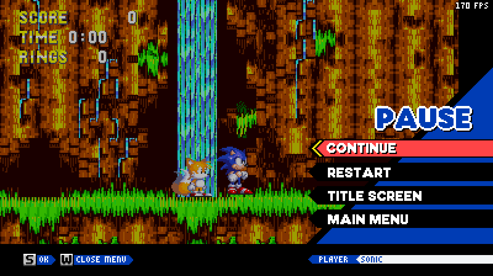
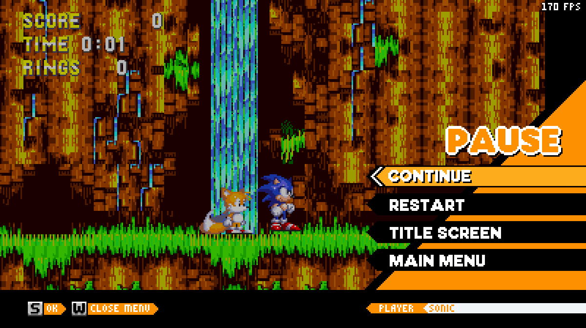
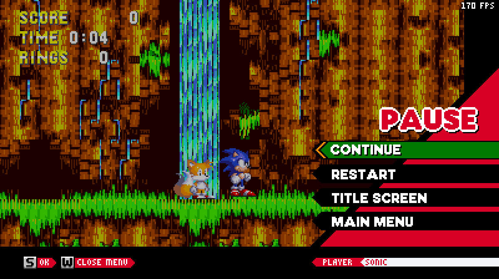
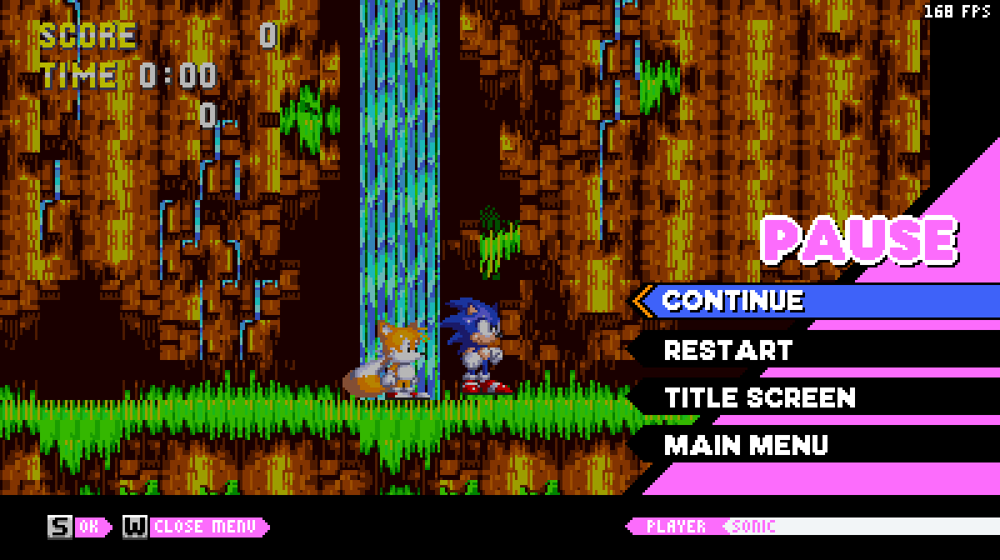
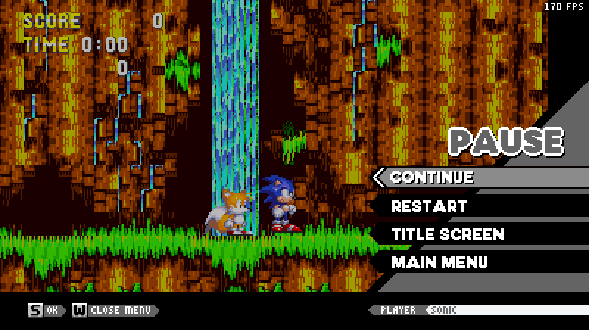
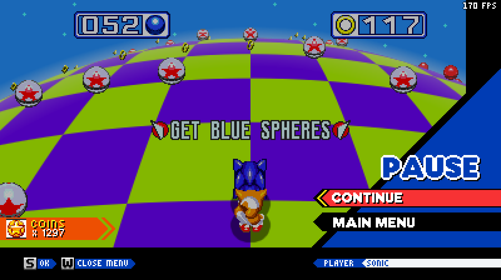

**THIS MOD REQUIRES [SONIC 3 A.I.R. 25.02.15.0](https://github.com/Eukaryot/sonic3air/releases/tag/v25.02.15.0-test) OR NEWER, OLDER VERSIONS WILL NOT WORK.**
This mod is an accurate recreation of the Sonic Origins pause menu for Sonic 3 A.I.R.

## List of features
* Multi-language support (English, Español, Français, Português (Brazil))
* Dialogs
* Themes
* Optional support for [Achievements Plus](https://github.com/fadeinside/s3air-achievements-plus), shows your coin amount on the pause menu
* Multiple Controller button sprites in the style of Sonic Origins (With the default 3 A.I.R. sprites being the default, due to them being dynamic)
* Username Display showing the name of the character and (if you wish) the partner, with the ability to set your own custom one

## Screenshots

## Modding 
For modding, see [DOCUMENTATION.md](./DOCUMENTATION.md)

# Credits
### Key Authors
* SammyGoesHowdy - Sprites/Coder
### Original Authors
* SEGA - Translations, creating Sonic Origins
* [BetaNCourses](https://gamebanana.com/members/1733915) -  Genesis Buttons for "Legacy" and "Achievements Plus" button icon styles and the BetaNCourses Button Icon Style
* [Timothy!](https://gamebanana.com/members/4096550) - Legacy Buttons, Spanish Translations
### Translations
* [Quix Daidouji 64](https://gamebanana.com/members/1944992) - Spanish Translations
* [S_A3](https://gamebanana.com/members/2547145) - Spanish Restart Prompt Translation
* [Useott](https://github.com/Useott) - Portuguese Translations
* [JC_thatone](https://gamebanana.com/members/1867395) - Portuguese Restart Prompt Translation
* [JimmyIs2Dumb](https://gamebanana.com/members/2784408) - French Restart Prompt Translation
* [Mefiresu](https://github.com/Mefiresu) - French Translations
### Special Thanks
* Team Galore Server & S3A.I.R. Community Server - Assistance
* [KellyM](https://github.com/possiblyamagicmage) - Code that makes the selection colours glow, major assistance with character palette theme
* [Nabbup](https://github.com/nabbup)
* [Dynamic Lemons](https://github.com/DynamicLemons) - Assistance with Custom Username loading, ECF Support
* [Nabbup](https://gamebanana.com/members/4837791)